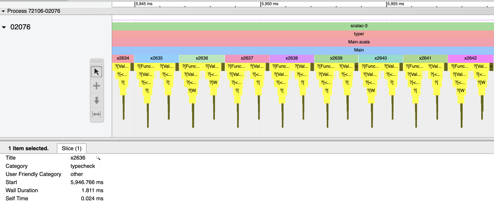
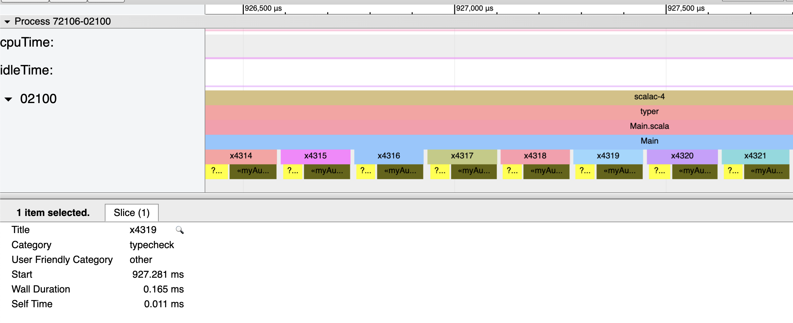

# fthomas-refined-macro-benchmark

```diff
3c3
< import eu.timepit.refined.api.{RefType, Validate}
---
> import eu.timepit.refined.api.{RefType, Refined, Validate}
10c10
< class RefineMacro(val c: blackbox.Context) extends MacroUtils with LiteralMatchers {
---
> class MyRefineMacro(val c: blackbox.Context) extends MacroUtils with LiteralMatchers {
14,17c14
<   def impl[F[_, _], T: c.WeakTypeTag, P: c.WeakTypeTag](t: c.Expr[T])(
<       rt: c.Expr[RefType[F]],
<       v: c.Expr[Validate[T, P]]
<   ): c.Expr[F[T, P]] = {
---
>   def impl[T: c.WeakTypeTag, P: c.WeakTypeTag](t: c.Expr[T]): c.Tree = {
25c22,24
<     val validate = validateInstance(v)
---
>     val validate = validateInstance[T, P].getOrElse(
>       abort(s"could not found Validate[${weakTypeOf[T]}, ${weakTypeOf[P]}]")
>     )
26a26
> 
30c30
<     c.universe.reify(rt.splice.unsafeWrap[T, P](t.splice))
---
>     c.universe.reify(reify(RefType[Refined]).splice.unsafeWrap[T, P](t.splice)).tree
33,40c33
<   def implApplyRef[FTP, F[_, _], T: c.WeakTypeTag, P: c.WeakTypeTag](t: c.Expr[T])(
<       ev: c.Expr[F[T, P] =:= FTP],
<       rt: c.Expr[RefType[F]],
<       v: c.Expr[Validate[T, P]]
<   ): c.Expr[FTP] =
<     c.Expr[FTP](impl(t)(rt, v).tree)
< 
<   private def validateInstance[T, P](v: c.Expr[Validate[T, P]])(implicit
---
>   private def validateInstance[T, P](implicit
43c36
<   ): Validate[T, P] =
---
>   ): Option[Validate[T, P]] =
53d45
<       .getOrElse(eval(v))
```

## original macro





## custom macro




